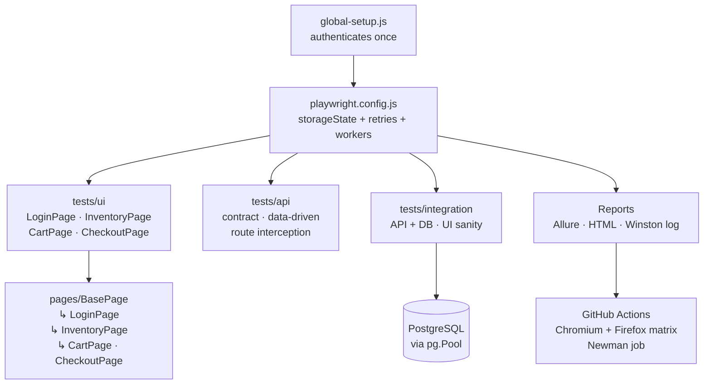

# Enterprise QA Automation Framework

Enterprise-level automation framework built using Playwright and JavaScript with integrated API testing, PostgreSQL database validation, Dockerised execution, CI/CD pipelines and AI-assisted testing workflows.

## Key Features

* UI automation with Playwright and Page Object Model
* API contract and integration testing
* PostgreSQL database validation with transaction rollback
* Dockerised test execution
* GitHub Actions CI/CD with browser matrix
* Allure and HTML reporting
* Parallel execution across Chromium and Firefox
* Automatic retry on CI flakiness
* AI-augmented test design workflow
* Cross-browser testing

## Architecture



## Technologies

| Layer | Tool |
|---|---|
| Test runner | Playwright |
| Language | JavaScript (CommonJS) |
| Database | PostgreSQL via `pg` |
| Containerisation | Docker |
| CI/CD | GitHub Actions |
| API collections | Postman + Newman |
| Reporting | Allure + Playwright HTML |
| Logging | Winston |
| AI-assisted design | GitHub Copilot · Claude · ChatGPT |

AI tools were used for test scenario generation, edge-case discovery, and Gherkin authoring — see [`ai-testing/`](./ai-testing/README.md) for the full workflow. Engineering judgment is responsible for all final implementation and validation decisions.

## Setup

### 1. Install dependencies

```bash
npm install
```

### 2. Copy environment template

```bash
# Mac / Linux
cp .env.example .env

# Windows (Command Prompt)
copy .env.example .env
```

### 3. Edit `.env`

Set `BASE_URL` to your target application, or leave the default (`https://www.saucedemo.com`) to run the sample Sauce Demo flow. Fill in `DB_*` values only if you want to run database integration tests locally.

## Run tests

```bash
# All tests
npm test

# By layer
npm run test:ui
npm run test:api
npm run test:integration

# Postman/Newman collection
npm run newman
```

## Run with Docker

```bash
# Build the image
docker build -t enterprise-qa .

# Run all tests inside the container
docker run --rm enterprise-qa

# Run a specific layer
docker run --rm enterprise-qa npx playwright test tests/api
```

## Run the database locally

```bash
# Start a local PostgreSQL instance using Docker Compose
docker-compose -f database/docker-compose.yml up -d

# Apply schema and seed data
psql -h localhost -U admin -d automation -f database/schema.sql
psql -h localhost -U admin -d automation -f database/seed.sql
```

## Reports

### Playwright HTML report
```bash
# Open the last HTML report
npm run report
```

### Allure report
```bash
# Generate the report from raw results
npm run allure:generate

# Open in browser
npm run allure:open
```

## Framework Design Decisions

### Why Playwright?

Playwright provides reliable cross-browser automation, automatic waiting mechanisms, network interception, native API testing via `request` fixtures, and parallel execution. Compared to Selenium, it significantly reduces flaky tests and simplifies modern web application testing.

### Why PostgreSQL?

PostgreSQL is one of the most widely used enterprise relational databases. Database validation allows verification that API and UI actions correctly persist data to the underlying storage layer — something UI assertions alone cannot confirm.

### Why Docker?

Docker provides a consistent, reproducible execution environment across developer machines and CI/CD runners. By containerising all dependencies, tests produce identical results regardless of operating system or local configuration.

### Why GitHub Actions?

GitHub Actions enables automated test execution on every push and pull request. It integrates directly with source control, allows quality gates before merge, and provides per-run artifact storage for reports, traces, and logs.

### Why API + database validation?

UI validation alone does not guarantee data integrity. Combining API testing with database validation ensures that business processes are correct throughout the full application stack — from browser interaction through API response to persisted state.

### Why AI-augmented testing?

AI tools such as GitHub Copilot, Claude, and ChatGPT accelerate repetitive engineering tasks including test data generation, edge-case discovery, exploratory testing preparation, and Gherkin scenario creation. Engineering judgment remains responsible for final validation and risk assessment. See [`ai-testing/`](./ai-testing/README.md) for the concrete workflow used in this project.